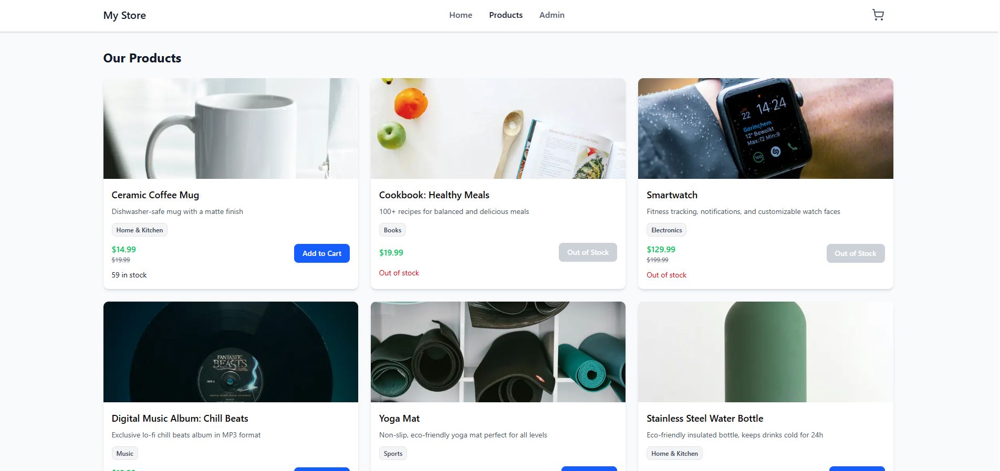

# Store Template

A full-featured e-commerce store built with Next.js 15, featuring a complete admin dashboard, shopping cart, and payment integration. This project demonstrates modern full-stack development practices with TypeScript, Prisma ORM, and AWS S3 for image storage.



## Overview

I built this store template as a foundation for quickly launching e-commerce websites. It includes all the essential features you'd expect from a modern online store - product browsing, cart management, checkout flow, and a comprehensive admin panel for managing inventory and orders.

## Key Features

### Customer-Facing Features
- **Product Catalog**: Browse products with filtering, search, and pagination
- **Product Details**: View detailed product information with image galleries
- **Shopping Cart**: Add/remove items with real-time cart updates
- **Checkout**: Complete checkout flow with PayPal integration
- **Stock Management**: Real-time stock availability warnings
- **Responsive Design**: Mobile-friendly interface with dark mode support

### Admin Dashboard
- **Product Management**: Create, edit, and delete products with image uploads
- **Order Management**: View and track customer orders
- **Inventory Control**: Monitor stock levels and product availability
- **Image Upload**: Direct AWS S3 integration for product images
- **Authentication**: Secure admin login system

## Tech Stack

- **Framework**: Next.js 15 with App Router
- **Language**: TypeScript
- **Database**: PostgreSQL with Prisma ORM
- **Styling**: Tailwind CSS 4
- **UI Components**: Radix UI primitives with custom components
- **State Management**: Zustand for cart state
- **Data Fetching**: TanStack Query (React Query)
- **File Storage**: AWS S3 for product images
- **Payment**: PayPal integration
- **Forms**: React Hook Form with Zod validation

## Project Structure

```
store-template/
├── prisma/              # Database schema and migrations
├── public/              # Static assets
├── src/
│   ├── app/            # Next.js app router pages
│   │   ├── (main)/    # Customer-facing pages
│   │   ├── admin/     # Admin dashboard pages
│   │   └── api/       # API routes
│   ├── components/    # React components
│   │   ├── admin/    # Admin-specific components
│   │   ├── cart/     # Shopping cart components
│   │   ├── checkout/ # Checkout flow components
│   │   ├── product/  # Product display components
│   │   ├── shared/   # Shared components
│   │   └── ui/       # Base UI components
│   ├── hooks/        # Custom React hooks
│   ├── lib/          # Utility libraries and configurations
│   ├── schemas/      # Zod validation schemas
│   ├── services/     # External service integrations
│   └── types/        # TypeScript type definitions
└── ...
```

## Getting Started

### Prerequisites

- Node.js 20+
- PostgreSQL database
- AWS S3 bucket (for image uploads)
- PayPal developer account (for payments)

### Installation

1. Clone the repository
```bash
git clone <your-repo-url>
cd store-template
```

2. Install dependencies
```bash
npm install
```

3. Set up environment variables
Create a `.env` file in the root directory with:
```env
DATABASE_URL="postgresql://..."
AWS_ACCESS_KEY_ID="your-access-key"
AWS_SECRET_ACCESS_KEY="your-secret-key"
AWS_REGION="your-region"
AWS_BUCKET_NAME="your-bucket-name"
NEXT_PUBLIC_PAYPAL_CLIENT_ID="your-paypal-client-id"
ADMIN_PASSWORD="your-admin-password"
```

4. Set up the database
```bash
npx prisma migrate dev
npx prisma db seed  # Optional: seed with sample data
```

5. Run the development server
```bash
npm run dev
```

Open [http://localhost:3000](http://localhost:3000) to view the store.

### Admin Access

Access the admin dashboard at `/admin` with the password configured in your environment variables.

**Demo credentials**: The default admin password is set for demonstration purposes (check the latest commit).

## Features in Detail

### Payment System
The payment system is built with a provider pattern, making it easy to swap or add new payment providers. Currently integrated with PayPal, but designed to support multiple payment methods.

### Image Management
Product images are uploaded directly to AWS S3 using presigned URLs for secure, efficient file transfers.

### Cart Management
The shopping cart uses Zustand for state management, providing a smooth user experience with persistent cart data.

### Admin Dashboard
A full-featured admin panel with:
- Product CRUD operations
- Order tracking and management
- Stock level monitoring
- Bulk operations support

## Development

```bash
# Run development server
npm run dev

# Build for production
npm run build

# Start production server
npm start

# Run database migrations
npx prisma migrate dev

# Open Prisma Studio
npx prisma studio
```

## Future Improvements

- [ ] Add more payment providers (Stripe, etc.)
- [ ] Implement customer accounts and order history
- [ ] Add product reviews and ratings
- [ ] Enhanced analytics in admin dashboard
- [ ] Email notifications for orders
- [ ] Multi-language support

## License

This project is open source and available for personal and commercial use.

---

Built with Next.js, TypeScript, and modern web technologies.
